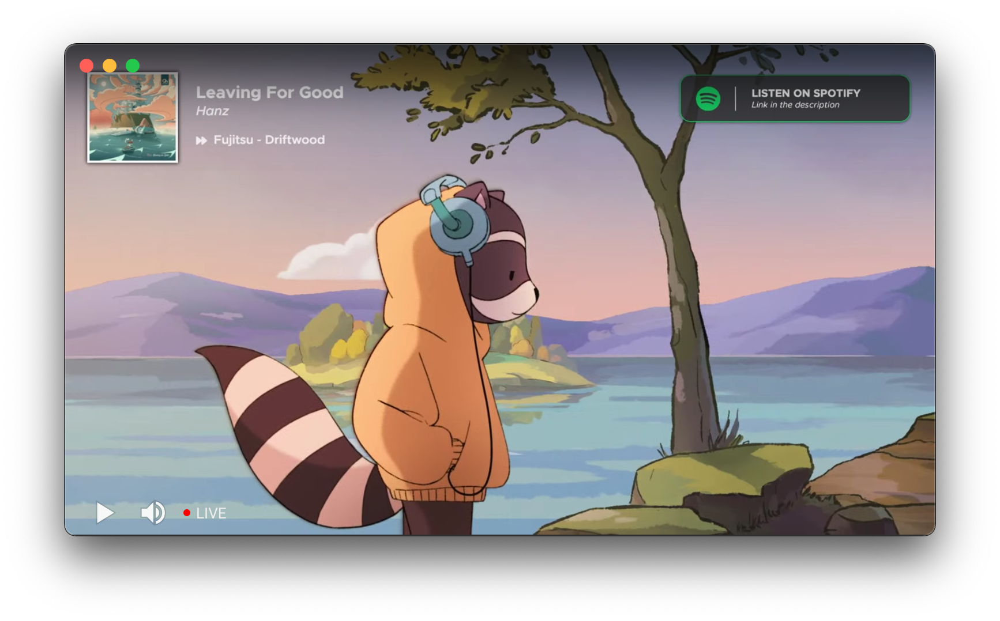

# Chillhop Radio

An (unofficial) native MacOS App for Chillhop Radio.

# Install

Navigate over to the [releases](https://github.com/aubreypwd/chillhop-radio-mac/releases) and download the latest version, or install via:

- [Homebrew...](https://github.com/aubreypwd/homebrew-cask#chillhop-radio)

# Development

1. Clone repo
2. `npm install`
3. `npm run build`

`npm run build` will built the application to `build/` and  `npm run dist` to generate a `.dmg` in `dist/` for distribution and installation.
